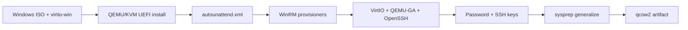

# Windows Golden Image Packer

Build **Windows Server 2022** and **2025** golden images as **qcow2** disks for **OpenShift Virtualization** (KubeVirt). Images default to **Standard Edition**, include **VirtIO** drivers and the **QEMU guest agent**, run **OpenSSH Server**, set the **Administrator** password, and optionally bake in **SSH public keys**.

## Features

| Requirement | Implementation |
|-------------|----------------|
| Windows Server 2022 / 2025 | `windows_version` variable (`2022` or `2025`) |
| Standard Edition (default) | `windows_edition` defaults to `Standard`; Datacenter supported |
| VirtIO drivers | WinPE driver paths in autounattend + `01-install-virtio-drivers.ps1` |
| QEMU guest agent | `02-install-qemu-guest-agent.ps1` from virtio-win ISO |
| OpenSSH | `03-configure-openssh.ps1` (Windows capability) |
| Administrator password | autounattend + `04-set-administrator-password.ps1` |
| SSH key injection | `ssh_public_keys` / `ssh_public_keys_file` + `05-inject-ssh-keys.ps1` |
| qcow2 for OpenShift Virt | QEMU builder, UEFI/OVMF, VirtIO disk/net, sysprep generalize |

## Prerequisites

On a Linux build host with KVM:

- [Packer](https://www.packer.io/) >= 1.9
- QEMU/KVM, `qemu-system-x86_64`, OVMF (`edk2-ovmf` or `ovmf` package)
- Windows Server **installation ISOs** (2022 and/or 2025) — licensed media from Microsoft
- [virtio-win](https://fedorapeople.org/groups/virt/virtio-win/direct-downloads/) ISO

```bash
# Fedora/RHEL example
sudo dnf install -y packer qemu-kvm edk2-ovmf

# Download virtio-win (optional helper)
make download-virtio
```

## Quick start

1. Copy the example variables and edit paths/secrets:

   Edit `example.pkrvars.hcl`, or copy it for secrets and overrides:

   ```bash
   cp example.pkrvars.hcl build.pkrvars.hcl
   # Edit build.pkrvars.hcl: ISO paths, admin_password, ssh_public_keys
   ```

2. Initialize Packer plugins and build:

   ```bash
   make init
   make validate      # uses packer/ci.pkrvars.hcl by default
   make build-2022    # or: make build-2025
   ```

   `make validate` works without editing var files. For builds, set real ISO paths in
   `example.pkrvars.hcl` or pass `VAR_FILE=build.pkrvars.hcl`.

3. Output image:

   ```text
   output/windows-server-2022-standard.qcow2
   ```

See [docs/openshift-virtualization.md](docs/openshift-virtualization.md) for importing the disk and VM settings.

## Variables

| Variable | Default | Description |
|----------|---------|-------------|
| `windows_version` | `2022` | `2022` or `2025` |
| `windows_edition` | `Standard` | `Standard` or `Datacenter` |
| `windows_iso_path` | (required) | Windows Server install ISO |
| `virtio_win_iso_path` | (required) | virtio-win ISO |
| `admin_password` | (required) | Administrator password (sensitive) |
| `ssh_public_keys` | `[]` | List of OpenSSH public keys |
| `ssh_public_keys_file` | `""` | File with one key per line |
| `output_directory` | `../output` | qcow2 output directory |
| `disk_size` | `80G` | Root disk size |
| `ovmf_code_path` | Fedora OVMF path | UEFI firmware for the build VM |

Build Datacenter 2025:

```bash
cd packer && packer build -var-file=../build.pkrvars.hcl \
  -var windows_version=2025 -var windows_edition=Datacenter
```

## Build flow



1. **Unattended install** from ISO with VirtIO storage/network drivers during WinPE.
2. **WinRM** connects for provisioning scripts.
3. **Sysprep** generalizes the disk for cloning; image shuts down.
4. Post-processor renames the qcow2 to `windows-server-{version}-{edition}.qcow2`.

## Repository layout

```text
packer/          Packer HCL (QEMU source + build)
http/            autounattend.xml.tpl
scripts/         PowerShell provisioning + sysprep
docs/            OpenShift Virtualization notes
example.pkrvars.hcl
```

## Security notes

- Do not commit `build.pkrvars.hcl` (gitignored); it contains passwords.
- Rotate the Administrator password after deploying VMs in production.
- Prefer SSH keys over password-only access where policy allows.
- Verify Windows ISO image index names if install fails at edition selection (`dism /Get-WimInfo` on the ISO).

## Troubleshooting

- **Install cannot see disk**: virtio-win drive letter during WinPE may not be `D:`. Adjust `DriverPaths` in `http/autounattend.xml.tpl` or add paths for `E:`.
- **WinRM timeout**: ensure the build host can reach the VM on port 5985; try `headless = false` to watch setup.
- **Wrong edition**: confirm `/IMAGE/NAME` in the ISO matches `locals.edition_image_names` in `packer/locals.pkr.hcl`.
- **OVMF not found**: set `ovmf_code_path` / `ovmf_vars_path` for your distribution.

## License

Provide your own Windows Server licenses for installation media and deployed VMs.
